# Anatomy of Sharingan

A complete technical description of the project: the problem it solves, the data it uses, and the
inner workings of every task. For each task it covers what goes in, what happens inside, what
comes out, and why it was built that way.

> **Sharingan** reads all 220 episodes of *Naruto* (Part I) with NLP and LLMs, then presents the
> results in a React + Tailwind website backed by a FastAPI service.

---

## Contents

1. [Problem statement](#1-problem-statement)
2. [System overview](#2-system-overview)
3. [Datasets](#3-datasets)
4. [Task 0: Ingestion and data cleaning](#4-task-0--ingestion-and-data-cleaning)
5. [Task 1: Web scraping (jutsu dataset)](#5-task-1--web-scraping-jutsu-dataset)
6. [Task 2: Theme classification (zero-shot NLI)](#6-task-2--theme-classification-zero-shot-nli)
7. [Task 3: Character network (NER + graph analytics)](#7-task-3--character-network-ner--graph-analytics)
8. [Task 4: Jutsu text classifier (fine-tuning)](#8-task-4--jutsu-text-classifier-fine-tuning)
9. [Task 5: Character chatbot (retrieval-augmented LLM)](#9-task-5--character-chatbot-retrieval-augmented-llm)
10. [Task 6: Serving layer (FastAPI)](#10-task-6--serving-layer-fastapi)
11. [Task 7: Website (React + Tailwind)](#11-task-7--website-react--tailwind)
12. [Configuration reference](#12-configuration-reference)
13. [Outputs reference](#13-outputs-reference)
14. [Testing, reproducibility and hardware](#14-testing-reproducibility-and-hardware)
15. [Known limitations and future work](#15-known-limitations-and-future-work)
16. [Glossary](#16-glossary)
17. [Appendix A: Training and fine-tuning procedures, step by step](#appendix-a-training-and-fine-tuning-procedures-step-by-step)

---

## 1. Problem statement

### 1.1 Motivation
A TV series is a large body of unstructured text: thousands of subtitle lines, scattered fan-wiki
articles and a handful of transcripts. Fans, writers and analysts want answers that are hard to get
by watching alone:

* What is the series *about*, and how do its themes shift from one story arc to the next?
* Who are the central characters, and who is connected to whom?
* Can a technique's description tell us what kind of technique it is?
* Can we *talk* to a character and have them answer in their own voice, grounded in what actually
  happened on screen?

### 1.2 Goal
Build an end-to-end, reproducible NLP system that turns raw, noisy series data into four
analytical products, plus an interface to explore them:

| # | Product | Question it answers | NLP technique |
|---|---|---|---|
| 1 | **Theme profile** | What is the series about, per episode and per arc? | Zero-shot classification via natural language inference |
| 2 | **Character network** | Who matters, who is close to whom, which groups exist? | Named-entity recognition + graph analytics |
| 3 | **Jutsu classifier** | Is a technique Ninjutsu, Genjutsu or Taijutsu? | Supervised text classification (fine-tuned transformer) |
| 4 | **Character chatbot** | What would Naruto (or Sasuke, Kakashi, …) say? | Retrieval-augmented generation with an instruction-tuned LLM |

### 1.3 Constraints that shaped the design
* **No labelled data** for themes or relationships. Those tasks must work zero-shot or unsupervised.
* **Very little speaker-attributed dialogue.** The transcript covers one episode, with 39 lines
  of Naruto. Subtitles carry no speaker names.
* **Noisy sources.** Subtitles contain song lyrics and formatting codes, the wiki listing pages
  block bots, and the jutsu classes are heavily imbalanced.
* **CPU-only execution.** The machine's GPU driver was not loaded (see §14.3), so every stage had to
  be practical on a 24-core CPU while still using the GPU automatically when one is available.

### 1.4 Success criteria
* Each stage is **idempotent and cached**: re-running is free, and the web app opens instantly.
* Every model is **measured honestly**: baselines, held-out test sets, cross-validation, and A/B
  tests for generative changes.
* Results are **explainable**: representative excerpts for themes, retrieved memories for chat,
  and per-class metrics for classification.

---

## 2. System overview

### 2.1 Architecture

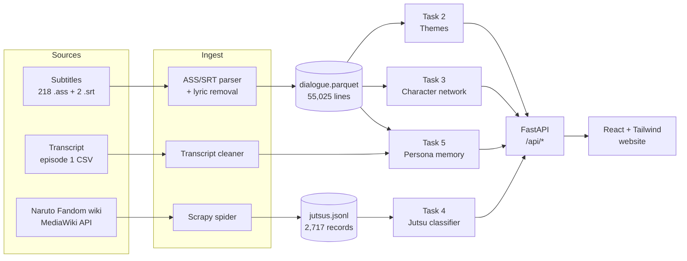

### 2.2 Code map

```text
src/sharingan/
  core/          config.py (typed YAML + env overrides), runtime.py (logging, device, caching)
  ingest/        subtitles.py, transcripts.py, jutsus.py, arcs.py
  scraping/      spiders/jutsu_api.py, wikitext.py, pipelines.py, items.py, runner.py
  analysis/
    themes.py                    Task 2
    characters/                  Task 3: cast.py, ner.py, graph.py, render.py
  models/
    jutsu/                       Task 4: data.py, baselines.py, trainer.py, crossval.py, inference.py
    persona/                     Task 5: cards.py, memory.py, engine.py, sft.py, evaluate.py
  pipeline.py                    idempotent stage runners shared by CLI + API
  interface/
    cli.py                       `sharingan` command
    api.py                       Task 6
web/src/                         Task 7: sections/, components/, lib/
tests/                           35 unit tests, no model downloads
```

### 2.3 Execution model
Every stage has a runner in `pipeline.py`. A runner **reuses persisted outputs** unless asked to
refresh, so the CLI computes once and the API only reads. The only live model calls are
custom theme scoring, jutsu classification and chat.

```text
sharingan all   =  themes → characters → jutsu train → persona memory
sharingan app   =  serve /api/* + the built website on one port
```

---

## 3. Datasets

### 3.1 Dataset A: episode subtitles
| Property | Value |
|---|---|
| Location | `data/raw/subtitles/` |
| Source | Fan subtitle files used by the reference project ([subtitlist.com](https://subtitlist.com)) |
| Coverage | Naruto Part I, Seasons 1–9, **episodes 1–220** |
| Files | 220: **218 Advanced SubStation Alpha (`.ass`)** + **2 SubRip (`.srt`)** (episodes 10 and 11) |
| Size | 6.3 MB of text |
| Raw lines | 60,843 dialogue events |
| Clean lines | **55,025** after removing 9.6% song lyrics |
| Words | 328,905 |
| Lines per episode | mean 250, min 127, max 368 |

**ASS format.** A `[Script Info]` header, a `[V4+ Styles]` section and an `[Events]` section. Each
event looks like this:
```text
Format: Layer,Start,End,Style,Name,MarginL,MarginR,MarginV,Effect,Text
Dialogue: 0,0:00:05.95,0:00:11.99,Default,,0000,0000,0000,,A long time ago, a powerful demon fox\Nappeared with nine tails.
```
`\N` is a forced line break and `{\i1}…{\i0}` are override tags. The `Text` field may itself contain
commas, so it must be split with `maxsplit`.

**SRT format.** Numbered blocks containing `HH:MM:SS,mmm --> HH:MM:SS,mmm` and text that may carry
`<i>` tags.

**Quirks found and handled**
1. **Song lyrics.** The opening and ending songs are subtitled in every episode. "*We are fighting
   dreamers aiming high*" appears in 52 episodes, and some lines in up to 78. Left in, they dominate
   themes like *hope*.
2. **Mixed formats.** A `*.ass` glob silently drops the two `.srt` episodes.
3. **No speaker names.** The `Name` field is empty, so subtitles say *what* was said but not
   *who* said it.

### 3.2 Dataset B: speaker-attributed transcript
| Property | Value |
|---|---|
| Location | `data/raw/transcripts/naruto_ep1.csv` |
| Source | Kaggle "Naruto ep 1 transcript" (via the reference project) |
| Rows | 163 (`name,line`) |
| Speakers | Iruka 59, **Naruto 39**, Mizuki 30, Hiruzen 9, … |
| Quirks | Stage directions in parentheses (`(Laughing)`), a few junk rows |

This is the only source that says *who* is speaking. It is far too small to fine-tune a
personality from, which drives the design of Task 5.

### 3.3 Dataset C: jutsu articles (scraped)
| Property | Value |
|---|---|
| Location | `data/raw/jutsus.jsonl` (JSON Lines) |
| Source | [naruto.fandom.com](https://naruto.fandom.com) `Category:Jutsu`, via the MediaWiki Action API |
| Records | **2,717** scraped, 10 dropped by validation |
| Usable for classification | **2,556** after labelling and filtering |
| Licence | CC BY-SA (Fandom) |

Record schema:

| Field | Type | Example |
|---|---|---|
| `name` | str | `"Dance of the Seedling Fern"` |
| `url` | str | `https://naruto.fandom.com/wiki/Dance_of_the_Seedling_Fern` |
| `page_id` | int | `2042` |
| `classification` | list[str] | `["Kekkei Genkai", "Ninjutsu"]` |
| `nature` | list[str] | `["Wind Release"]` |
| `rank` | str \| null | `"A"` |
| `class_type` | str \| null | `"Offensive"` |
| `range` | str \| null | `"Short, Mid, Long"` |
| `hand_signs` | list[str] | `["Snake", "Rat"]` |
| `users` | list[str] | `["Kabuto Yakushi", "Kimimaro"]` |
| `debut_anime` | str \| null | `"127"` |
| `description` | str | Article prose, with templates, refs, files and trivia removed |

**Class balance** (primary label, see §8.3): Ninjutsu 2,076 (81.2%), Taijutsu 404 (15.8%),
Genjutsu 76 (3.0%).

### 3.4 Dataset D: reference snapshot (fallback)
`data/reference/jutsus_reference.jsonl` is the reference project's older scrape: 2,920 records in a
flat `jutsu_name, jutsu_type, jutsu_description` schema. The loader accepts both schemas and uses
this file only when nothing has been scraped yet.

### 3.5 Derived dataset: story arcs
`ingest/arcs.py` maps every episode to a narrative arc, which gives themes and networks a story axis:

| Episodes | Arc |
|---|---|
| 1–5 | Prologue |
| 6–19 | Land of Waves |
| 20–67 | Chūnin Exams |
| 68–80 | Konoha Crush |
| 81–100 | Search for Tsunade |
| 101–106 | Land of Tea (filler) |
| 107–135 | Sasuke Recovery Mission |
| 136–220 | Post-Recovery (filler) |

---

## 4. Task 0: Ingestion and data cleaning

**Code:** `ingest/subtitles.py`, `ingest/transcripts.py`, `ingest/jutsus.py` · **Runner:** `pipeline.dialogue()`

### 4.1 Input → output
| | |
|---|---|
| **Input** | `data/raw/subtitles/*.ass, *.srt` |
| **Output** | `data/processed/dialogue.parquet`, one row per subtitle event |

Output schema:

| Column | Type | Meaning |
|---|---|---|
| `episode` | int | 1–220, parsed from the file name (`Season N - EE`) |
| `season` | int | 1–9 |
| `start`, `end` | float | Seconds from episode start |
| `text` | str | Cleaned line |
| `line_idx` | int | Position within the episode (0-based, time-ordered) |
| `is_song` | bool | Lyric flag (all `False` in the saved file, because lyrics are dropped) |
| `arc` | str | Story arc (§3.5) |

### 4.2 Anatomy
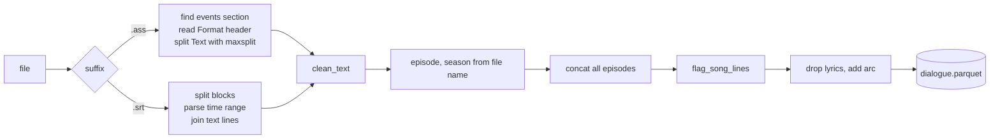

1. **Format-aware parsing.** The ASS parser reads the `Format:` line of `[Events]` to locate the
   `Start`, `End` and `Text` columns, rather than assuming positions. It splits each `Dialogue:`
   line with `maxsplit = n_fields − 1`, so commas inside dialogue survive. `Comment:` events are
   ignored.
2. **Text cleaning** (`clean_text`). Removes `{…}` override tags, converts `\N`, `\n` and `\h` to
   spaces, strips HTML tags (SRT `<i>`), normalises curly quotes, and collapses whitespace.
3. **Lyric detection** (`flag_song_lines`). A line is a lyric when **all three** hold:
   * its normalised text (lowercase letters, apostrophes and spaces only) appears in at least
     `song_min_episodes = 5` different episodes,
   * it starts within `song_window_seconds = 150` of the episode's start or end, and
   * it has at least 3 words, so repeated exclamations like "Naruto!" survive.

   Each rule alone gives false positives: lyrics repeat, but so do catchphrases, and the opening
   recap sits in the same window. Together they removed **5,818 lines (9.6%)**.
4. **Episode scripts** (`episode_scripts`). Joins lines into one script per episode when a task
   needs whole-episode text.

**Transcript cleaning** (`load_transcript`): removes `(…)` and `[…]` stage directions and normalises
quotes. It adds `prev_speaker` and `prev_line`, so every turn knows what it is responding to.

**Jutsu loading** (`load_jutsus`): see §8.3.

---

## 5. Task 1: Web scraping (jutsu dataset)

**Code:** `scraping/` · **CLI:** `sharingan scrape [--limit N]`

### 5.1 Problem
Collect a labelled corpus of techniques (name, description, classification) for Task 4. The
reference project scraped the HTML page `Special:BrowseData/Jutsu`, which now returns **HTTP 403**
(a Cloudflare bot challenge) to automated clients.

### 5.2 Input → output
| | |
|---|---|
| **Input** | `https://naruto.fandom.com/api.php` (MediaWiki Action API) |
| **Output** | `data/raw/jutsus.jsonl` (schema in §3.3), plus an HTTP cache in `data/raw/.scrapy-cache/` |

### 5.3 Anatomy
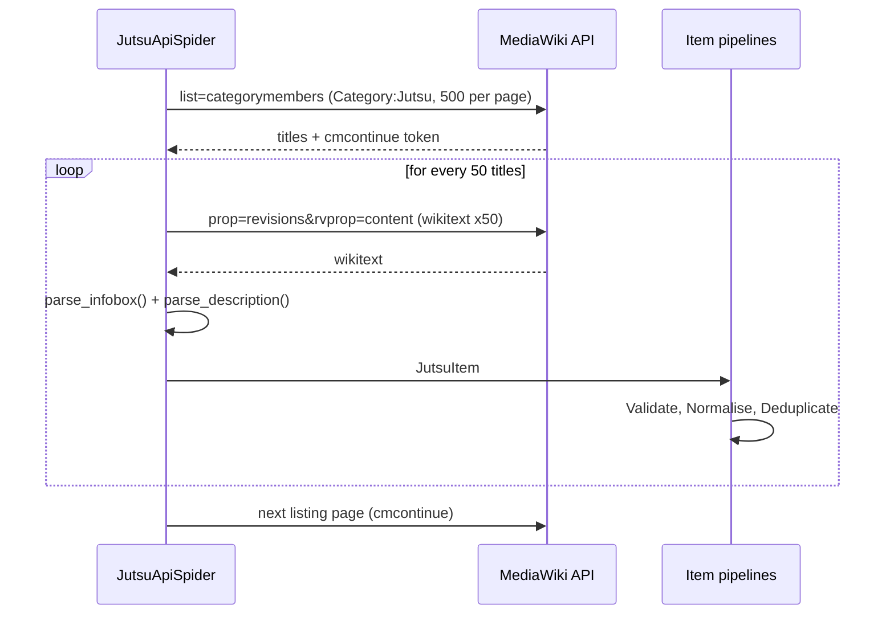

1. **Listing.** `list=categorymembers` returns up to 500 titles per call, with a `cmcontinue`
   cursor for pagination.
2. **Batch fetch.** `prop=revisions` returns the **wikitext of 50 pages per request**, so the
   whole crawl is **62 requests** instead of about 3,000 page loads.
3. **Infobox parsing** (`wikitext.parse_infobox`). `mwparserfromhell` locates the
   `{{Infobox/Jutsu}}` template and reads typed fields (`jutsu classification`, `jutsu type`,
   `jutsu rank`, `jutsu class type`, `jutsu range`, `hand signs`, `users`, `debut anime`).
   List fields are split on commas, `~anime`/`~movie` qualifiers and `(missing-nin)` notes are
   removed, and `<ref>` tags and comments are dropped.
4. **Prose extraction** (`wikitext.parse_description`). Iterates over sections and skips *Trivia*,
   *References*, *See also*, *Notes*, *In other media* and *Gallery*. It removes headings,
   templates, and file, category and interlanguage links (`es:…`), then strips the remaining
   markup to plain text.
5. **Item pipelines.** `ValidatePipeline` drops items with no classification or a description
   under 20 characters (10 dropped). `NormalisePipeline` applies Unicode NFC and collapses
   whitespace. `DeduplicatePipeline` dedupes by `page_id`.
6. **Politeness.** A descriptive User-Agent, `ROBOTSTXT_OBEY`, AutoThrottle, 2 concurrent requests,
   a 0.5 s delay, `maxlag=5`, retries on 429/5xx, and a 7-day HTTP cache.

### 5.4 Result
2,717 items in 62 requests, with 0 errors and 10 validation drops. The parsers are pure functions,
unit-tested against a sample infobox (`tests/test_scraping.py`).

---

## 6. Task 2: Theme classification (zero-shot NLI)

**Code:** `analysis/themes.py` · **Runner:** `pipeline.run_themes()` · **CLI:** `sharingan themes`

### 6.1 Problem
Measure how strongly each of a set of themes appears in each episode, without any labelled data.

### 6.2 Input → output
| | |
|---|---|
| **Input** | `dialogue.parquet` + theme labels (`config.themes.labels`) |
| **Output 1** | `outputs/themes/episodes.parquet`: 220 rows × (episode, season, arc, n_chunks, one column per theme) |
| **Output 2** | `outputs/themes/chunks.parquet`: 1,625 rows × (episode, season, arc, chunk_id, text, one column per theme) |
| **Default themes** | friendship, hope, sacrifice, battle, self development, betrayal, love, loneliness, revenge, family |

### 6.3 Method: NLI as a zero-shot classifier
A Natural Language Inference model is trained to decide whether a *premise* entails a
*hypothesis*. Each theme becomes a hypothesis:

```text
premise    = <a chunk of episode dialogue>
hypothesis = "This dialogue is about {theme}."
score      = softmax([logit_not_entail, logit_entail])[entail]   →  P(entailment) ∈ [0, 1]
```

Themes are scored **independently** (multi-label), so they do not compete for probability mass.
An episode can be about both battle *and* friendship.

**Model:** `MoritzLaurer/deberta-v3-base-zeroshot-v2.0` (DeBERTa-v3-base, about 184M parameters). It
is trained specifically for zero-shot classification, with a binary `entailment` /
`not_entailment` head. The code also supports 3-way MNLI heads such as `facebook/bart-large-mnli`
by resolving label ids from the model config.

### 6.4 Anatomy
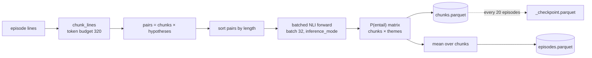

1. **Token-budgeted chunking.** Consecutive whole subtitle lines are packed greedily until the
   next line would exceed 320 tokens. Chunks therefore never cut a line in half, and nothing is
   truncated (`max_length = 320 + 48` leaves room for the hypothesis). The result is 1,625 chunks,
   7.4 per episode on average.
2. **Pair construction.** 1,625 chunks × 10 hypotheses = **16,250 NLI pairs**.
3. **Length-sorted batching.** Pairs are sorted by length before batching, which minimises padding.
4. **Scoring.** The entail-vs-not logits are softmaxed and P(entail) is kept.
5. **Aggregation.** An episode's theme score is the mean over its chunks.
6. **Checkpointing.** Partial results are written every 20 episodes, and a restart resumes from
   them. This was used in practice when the first run was interrupted at episode 200.

### 6.5 Derived views
| View | Formula | Used for |
|---|---|---|
| Series profile | `mean(theme)` over episodes, plus a value relative to the top theme | Bar chart |
| Arc lift | `mean_arc(theme) / mean_series(theme)` (1.0 = average) | Diverging heatmap |
| Trajectory | 9-episode centred rolling mean | Line chart |
| Representative excerpts | top-k chunks by score | Quote cards |
| Theme lab | live scoring of custom labels on ≤ 20 episodes | Interactive |

### 6.6 Results
* **Series profile:** battle 0.39, revenge 0.24, betrayal 0.15, sacrifice 0.08, family 0.07,
  hope 0.05, self development 0.03, friendship 0.02, love 0.01, loneliness 0.01.
  The v2.0 model is conservative, so read the numbers as relative.
* **Arc lift**, qualitatively validated against the story:

| Arc | Highest lift | Story |
|---|---|---|
| Prologue | friendship ×2.71, loneliness ×2.34 | Naruto the outcast, Iruka's acceptance |
| Land of Waves | self development ×2.45, sacrifice ×1.53 | Haku and Zabuza |
| Konoha Crush | loneliness ×4.49, love ×4.37, sacrifice ×1.75 | Gaara's backstory, the Third Hokage's death |
| Sasuke Recovery Mission | friendship ×2.94 | Naruto chasing Sasuke |
| Land of Tea (filler) | betrayal ×2.13 | |

* **Cost:** about 11 pairs per second on CPU, about 35 minutes for the full series.

### 6.7 Limitations
* NLI scores reflect the *literal* dialogue. Themes carried by visuals or music are invisible.
* Absolute probabilities depend on the hypothesis wording. Compare themes against each other, not
  against a fixed threshold.

---

## 7. Task 3: Character network (NER + graph analytics)

**Code:** `analysis/characters/` · **Runner:** `pipeline.run_characters()` · **CLI:** `sharingan characters`

### 7.1 Problem
Find every mention of a character in the dialogue, link characters who are mentioned close
together, and measure who is central and which groups form.

### 7.2 Input → output
| | |
|---|---|
| **Input** | `dialogue.parquet` |
| **Output 1** | `outputs/characters/mentions.parquet`: one row per (line, character) |
| **Output 2** | `outputs/characters/edges.parquet`: `source, target, weight, cooccurrences, episodes` |
| **Output 3** | `outputs/characters/metrics.parquet`: `character, mentions, degree, strength, pagerank, betweenness, eigenvector, community` |
| **Output 4** | `outputs/characters/network.html`: standalone interactive graph (PyVis) |

Mention schema: `episode, arc, line_idx, start, character (canonical), surface (as written),
source ("gazetteer" | "model")`.

### 7.3 Anatomy
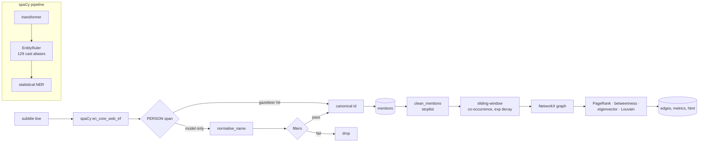

#### Step 1: mention extraction (`ner.py`)
* **Model:** spaCy `en_core_web_trf` (RoBERTa-based). Only the `transformer` and `ner` components
  run.
* **Gazetteer** (`cast.py`): **71 canonical characters with 129 aliases**, inserted as an
  `EntityRuler` *before* the statistical NER (`overwrite_ents=True`). The patterns are
  **case-sensitive phrases**, so "Guy" (the sensei) matches but "that guy" does not, and
  hyphenated nicknames such as "Ero-Sennin" match.
* **Alias resolution** (`normalise_name`), applied to model-only spans:

| Rule | Example |
|---|---|
| strip possessive | `Neji's` → `Neji` |
| strip honorific | `Sasuke-kun` → `Sasuke`, `Hinata-sama` → `Hinata` |
| strip title | `Lady Tsunade` → `Tsunade`, `Lord Orochimaru` → `Orochimaru` |
| alias table | `Pervy Sage` → `Jiraiya`, `Lee` → `Rock Lee` |
| first-name fallback | `Naruto Uzumaki-kun` → `Naruto` |
| truncated speech | `Sakur--` → `Sakura` (unique alias prefix) |
| all caps | `NARUTO` → `Naruto` |

* **Filters for model-discovered names**, which are not in the cast list:
  * the name must look like a proper noun (`^[A-Z][a-z…]+( [A-Z]…){0,2}$`) and have at least 4 characters,
  * it must not be on the **stoplist** (76 entries: titles, clan names, interjections, places,
    concepts), and
  * **every token must be a rare English word**: `wordfreq` Zipf frequency below 3.0.
    "Gennai" (1.0) passes, while "Transform" (4.0), "Jerk" (4.0) and "Love" (5.8) do not.
* Each character counts at most **once per line**.

#### Step 2: co-occurrence weighting (`graph.py`)
For each episode, with mentions sorted by `line_idx`, every pair of different characters
mentioned within `window = 10` lines of each other contributes:

$$ w_{ab} \mathrel{+}= \exp\left(-\frac{d}{\tau}\right), \qquad d = |line_a - line_b|,\ \tau = 4 $$

Names in the same exchange (d = 1, weight 0.78) count far more than names a scene apart
(d = 10, weight 0.08). A flat window count would treat them the same. The step also records raw
co-occurrences and the number of distinct shared episodes. Characters with fewer than
`min_mentions = 8` mentions are excluded. Pairs never link across episodes.

#### Step 3: graph analytics
| Metric | Definition | What it tells you |
|---|---|---|
| `mentions` | lines mentioning the character | Screen presence |
| `degree` | number of distinct neighbours | Breadth of connections |
| `strength` | sum of edge weights | Intensity of connections |
| `pagerank` | weighted PageRank | Importance via important neighbours |
| `betweenness` | shortest-path betweenness on `distance = 1/weight` | Bridges between groups |
| `eigenvector` | weighted eigenvector centrality | Membership of the core |
| `community` | Louvain modularity (seeded) | Social groups |

#### Step 4: rendering
* `render.py` exports a self-contained PyVis/vis.js HTML file (`network.html`), with communities
  coloured from a CVD-validated palette and nodes sized by PageRank.
* The website draws its own canvas graph from `/api/characters` (§11).

### 7.4 Results
* **9,913 mentions**: 7,930 from the gazetteer and 1,983 discovered by the model.
* **107 characters and 887 relationships**, after an audit added five non-characters to the
  stoplist (*Sannin*, *Kekkei Genkai*, *Dojo*, *Ichiraku*, *Kujaku*).
* **Most central characters:** Naruto (PageRank 0.144, betweenness **0.877**), Sasuke (0.078),
  Sakura, Orochimaru, Hinata, Tsunade, Rock Lee, Kiba, Kakashi, Neji.
* **Strongest tie:** Naruto–Sasuke (weight 349, 875 co-occurrences across 108 episodes).
* **Communities found without supervision:** Team 7 (Naruto · Sasuke · Sakura · Kakashi), the
  Sannin (Orochimaru · Tsunade · Jiraiya), the rookie teams (Hinata · Kiba · Shikamaru · Choji),
  Lee · Neji · Gaara · Guy, and one community per filler arc.
* **Discovery:** filler characters missing from the cast list were found by the model (Yakumo,
  Sumaru, Idate, Menma, Raiga).
* **Cost:** about 3.5 minutes for 55k lines on CPU.

### 7.5 Limitations
* Mentions are *names said aloud*, not *people on screen*. Vocatives ("Naruto!") dominate, so
  the network measures conversational salience.
* Ambiguous titles ("Lord Hokage" refers to Hiruzen before episode 95 and Tsunade after) are
  deliberately not mapped.

---

## 8. Task 4: Jutsu text classifier (fine-tuning)

**Code:** `models/jutsu/` · **Runners:** `run_jutsu_training()`, `run_jutsu_crossval()` ·
**CLI:** `sharingan jutsu train | cv | predict`

### 8.1 Problem
Given a technique's name and description, predict its primary type: **Ninjutsu**, **Genjutsu** or
**Taijutsu**. This is 3-class, single-label classification with severe imbalance (Genjutsu is 3%).

### 8.2 Input → output
| | |
|---|---|
| **Input** | `jutsus.jsonl` (or the fallback snapshot) |
| **Model output** | `outputs/models/jutsu/model/` (Hugging Face format, 602 MB) + `training_report.json` |
| **Report** | `outputs/models/jutsu/reports/metrics.json` (baselines + transformer on the test split) |
| **CV report** | `outputs/models/jutsu/reports/crossval.json` |
| **Inference** | text → `{"Genjutsu": p, "Ninjutsu": p, "Taijutsu": p}` |

### 8.3 Labelling (`ingest/jutsus.py`)
The wiki's classification is multi-valued (e.g. `["Kekkei Genkai", "Ninjutsu", "Taijutsu"]`).
The primary label uses a fixed priority:

```text
contains "Genjutsu"  → Genjutsu      (an illusion delivered by any means is a genjutsu)
else "Ninjutsu"      → Ninjutsu      (chakra-moulded techniques)
else "Taijutsu"      → Taijutsu      (pure physical combat)
else                 → dropped       (e.g. Kenjutsu-only, Fūinjutsu-only)
```

The model input is `text = name + ". " + description`. Records with no label, a description of 20
characters or fewer, or a duplicate name are dropped, leaving **2,556 examples**.

### 8.4 Anatomy
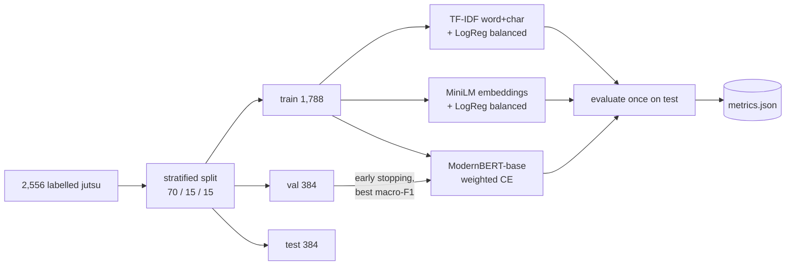

**Baselines** (`baselines.py`)
* **TF-IDF + logistic regression:** word 1–2-grams (English stop words removed) unioned with
  character 3–5-grams, sublinear TF, `C = 8`, `class_weight="balanced"`.
* **Embeddings + logistic regression:** `all-MiniLM-L6-v2` sentence embeddings (384-d,
  normalised), `C = 4`, balanced.

**Transformer** (`trainer.py`)

| Setting | Value |
|---|---|
| Encoder | `answerdotai/ModernBERT-base` (about 149M parameters, 8k context) |
| Max length | 256 tokens |
| Loss | Cross-entropy with **inverse-frequency class weights**: Genjutsu 11.04, Ninjutsu 0.41, Taijutsu 2.11 (via `Trainer(compute_loss_func=…)`) |
| Optimiser | AdamW, lr 5e-5, weight decay 0.01, cosine schedule, 10% warm-up |
| Batch | 16 (eval 32) |
| Epochs | up to 4, evaluated each epoch |
| Model selection | best **validation macro-F1**, early stopping with patience 2 |
| Test | evaluated **exactly once**, after selection |

> The exact step-by-step training procedure (seeding, class weights, tokenisation, optimisation,
> early stopping, persistence) is in [Appendix A.4](#a4-full-fine-tuning-of-the-jutsu-classifier-modernbert-base),
> and the cross-validation protocol is in [A.5](#a5-cross-validation-procedure).

**Why macro-F1?** With 81% Ninjutsu, predicting Ninjutsu for everything already scores 81%
accuracy. Macro-F1 weights the three classes equally, so a model is rewarded only if it handles
Genjutsu and Taijutsu.

### 8.5 Results: single held-out split (384 test examples, 11 of them Genjutsu)
| Model | Macro-F1 | Accuracy | F1 Genjutsu | F1 Ninjutsu | F1 Taijutsu | Train time |
|---|---|---|---|---|---|---|
| TF-IDF + LogReg | 0.792 | 0.896 | 0.74 | 0.94 | 0.70 | 4 s |
| MiniLM + LogReg | 0.739 | 0.885 | 0.52 | 0.93 | 0.77 | 13 s |
| **ModernBERT-base** | **0.797** | **0.914** | 0.67 | **0.95** | **0.78** | 19 min |

ModernBERT's best checkpoint came at epoch 2 (validation macro-F1 0.856). Its confusion matrix
(rows = true labels Genjutsu, Ninjutsu, Taijutsu) is `[[6, 5, 0], [1, 298, 13], [0, 14, 47]]`.

### 8.6 Results: 5-fold cross-validation
With only 11 Genjutsu test examples, one prediction moves Genjutsu F1 by about 0.06, so a single
split cannot separate the models. `crossval.py` runs **stratified 5-fold CV over all 2,556
examples**, with **identical folds for every model** (a paired comparison). Within each fold, the
transformer carves 15% of the training part off as a validation set for early stopping, so the
test fold is never used for selection.

| Model | Macro-F1 | Accuracy | F1 Genjutsu | F1 Ninjutsu | F1 Taijutsu |
|---|---|---|---|---|---|
| TF-IDF + LogReg | 0.849 ± 0.044 | 0.917 ± 0.025 | **0.831 ± 0.045** | 0.950 ± 0.015 | 0.766 ± 0.077 |
| MiniLM + LogReg | 0.762 ± 0.028 | 0.866 ± 0.009 | 0.665 ± 0.080 | 0.914 ± 0.006 | 0.708 ± 0.024 |
| **ModernBERT-base** | **0.854 ± 0.035** | **0.923 ± 0.013** | 0.826 ± 0.084 | **0.953 ± 0.008** | **0.784 ± 0.041** |

(mean ± sample standard deviation over 5 folds; ModernBERT trained for up to 3 epochs per fold)

Macro-F1 for each fold:

| Fold | TF-IDF | MiniLM | ModernBERT | ModernBERT − TF-IDF |
|---|---|---|---|---|
| 1 | 0.814 | 0.783 | 0.838 | +0.024 |
| 2 | 0.863 | 0.764 | 0.834 | −0.030 |
| 3 | 0.797 | 0.734 | 0.828 | +0.031 |
| 4 | 0.906 | 0.734 | 0.859 | −0.047 |
| 5 | 0.864 | 0.795 | 0.913 | +0.049 |
| **Mean** | **0.849** | **0.762** | **0.854** | **+0.005 ± 0.041** (3/5 folds won) |

**Interpretation**
* **ModernBERT and TF-IDF are statistically tied.** The mean paired difference (+0.005) is about
  one-eighth of its standard deviation (0.041), and each model wins some folds.
* **ModernBERT is more stable.** Its macro-F1 spread is ±0.035 against ±0.044, its accuracy spread is
  ±0.013 against ±0.025, and it is better on Taijutsu (0.784 against 0.766), the class most often
  confused with Ninjutsu.
* **TF-IDF is remarkably strong** on this task. Jutsu descriptions are full of decisive lexical cues
  ("illusion", "kick", "Release:"), which character and word n-grams capture directly. It trains in
  about 4 seconds; ModernBERT takes about 16 minutes per fold on CPU.
* **Sentence embeddings lag** (0.762). General-purpose semantic vectors blur the technical vocabulary
  that separates the classes.
* **The single split was misleading in its details.** It made TF-IDF look weaker (0.792, its unlucky
  fold) and ModernBERT look worse on Genjutsu than it is. Cross-validation corrects both.

**Recommendation:** serve ModernBERT (slightly higher and more stable), but treat TF-IDF as a
first-class alternative wherever latency or compute matters.

### 8.7 Inference
`JutsuClassifier(model_path).predict_proba(texts)` returns a softmax over the three labels. For
example, *"The user traps the target in an illusion where they relive their worst memory…"* gives
Genjutsu 0.77, Ninjutsu 0.19 and Taijutsu 0.03.

---

## 9. Task 5: Character chatbot (retrieval-augmented LLM)

**Code:** `models/persona/` · **Runners:** `persona_memory()`, `persona_engine()`, `run_persona_training()` ·
**CLI:** `sharingan persona memory | chat | train | eval`

### 9.1 Problem
Let a user hold a conversation with a character who answers **in character** (personality, speech
patterns, relationships) and **grounded in the show** (real events), with very little speaker-labelled
data: 39 Naruto lines.

### 9.2 Input → output
| | |
|---|---|
| **Inputs** | `dialogue.parquet`, `naruto_ep1.csv`, character cards (`cards.py`) |
| **Memory output** | `outputs/persona/memory/voice.parquet` (188 exchanges), `scenes.parquet` (13,453 windows), `embeddings.npz` (`voice` 188×384, `scenes` 13,453×384) |
| **Request** | `{character, message, history[]}` |
| **Response** | A streamed reply, plus the retrieved memories (`voice[]`, `scenes[]`) |

**Supported characters:** Naruto, Sasuke, Sakura, Kakashi, Shikamaru, Rock Lee.

### 9.3 Anatomy
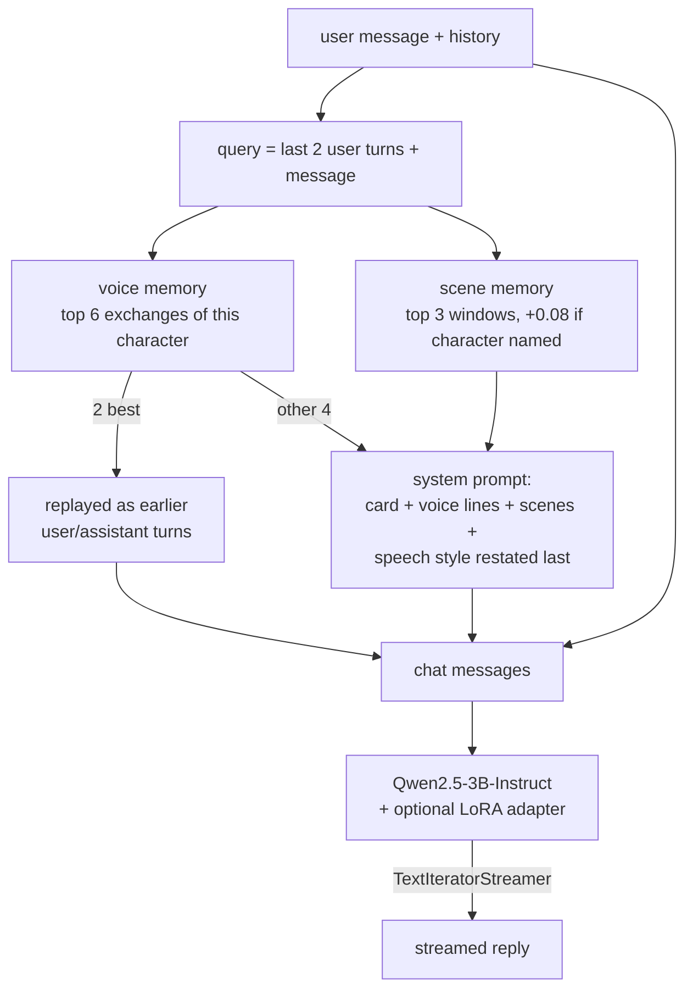

#### Layer 1: character cards (`cards.py`)
A frozen dataclass per character with these fields: `identity`, `personality`, `speech` (verbal
tics and forms of address), `relationships`, `greeting`, and an optional `signature` regex.
`system_prompt(voice, scenes)` assembles the prompt. The character's speech style is
**restated as the final instruction**, because small models weight the end of the prompt most.

#### Layer 2: voice memory (`memory.py → build_voice_table`)
`(context, line)` exchanges spoken by the character, from two sources:

| Source | How the speaker is known | Rows |
|---|---|---|
| Transcript | `speaker == card.name`, at least 4 words | Naruto 27, Sakura 3, Shikamaru 1 |
| Subtitles, weakly attributed | The line matches the card's high-precision **signature**: Naruto `\bbelieve it\b`, Shikamaru `what a drag\|troublesome`, Rock Lee `\byouth\b` | Naruto 95, Shikamaru 33, Rock Lee 29 |

The context of a subtitle exchange is the previous subtitle line in the same episode. Low-precision
signatures (e.g. Sasuke's "avenge", also said by filler villains) were left out.

#### Layer 3: scene memory (`build_scene_table`)
Overlapping windows of 8 subtitle lines with a stride of 4, across all 220 episodes: **13,453
windows**, each tagged with its episode and arc.

#### Retrieval
* **Encoder:** `sentence-transformers/all-MiniLM-L6-v2`, 384-d, L2-normalised. Similarity is the dot
  product (cosine).
* **Voice:** filter to the character's exchanges, then take the top `retrieved_examples + 2 = 6`
  by similarity to the query.
* **Scenes:** similarity to `"<character>: <query>"`, plus a **+0.08 boost** if the window names the
  character. Top 3.

#### Prompt assembly (`engine.prepare`)
```text
[system]    card + 4 voice lines + 3 scenes + "Above all, sound like <name>: <speech>"
[user]      <context of best voice exchange #1>      ┐ few-shot demonstration turns:
[assistant] <real line #1>                           │ small chat models imitate their own
[user]      <context of best voice exchange #2>      │ earlier turns far more than prompt text
[assistant] <real line #2>                           ┘
[...]       last 6 real conversation turns
[user]      <current message>
```

#### Generation (`engine.stream`)
| Setting | Value |
|---|---|
| Base model | `Qwen/Qwen2.5-3B-Instruct` (fp32 on CPU; bf16 on GPU; ≥7B models load in 4-bit NF4) |
| Sampling | temperature 0.7, top-p 0.9, repetition penalty 1.1, max 160 new tokens |
| Streaming | `TextIteratorStreamer` on a worker thread, joined on completion |
| Post-processing | strip a leading `"Naruto:"`-style prefix |
| Adapters | every `outputs/models/persona-lora/<Character>/` is loaded with PEFT and activated per character; `use_adapter=False` forces the base model |

**Why 3B over 1.5B?** In side-by-side tests the 1.5B model gave generic replies. The 3B model held
the voices: Shikamaru said "Hmm... How troublesome would that be?", Kakashi said "Ah, the road of
life gets a bit bumpy at times…", and Sasuke said "Hmpf. Idiot." On CPU the first token arrives in
about 2 s, then text streams at about 2 words/s.

### 9.4 Optional: LoRA fine-tuning (`sft.py`)
* **Data:** conversational *prompt–completion* records, where
  `prompt = [system: card, user: context]` and `completion = [assistant: real line]`.
* **Trainer:** TRL `SFTTrainer` with `completion_only_loss=True`, so the loss is computed only on
  the character's reply.
* **LoRA:** r = 16, α = 32, dropout 0.05, `target_modules="all-linear"`. lr 2e-4, cosine schedule,
  10% warm-up, batch 4 × gradient accumulation 2, max length 512, gradient-norm clip 0.3.
  On CUDA with bitsandbytes this becomes QLoRA (4-bit NF4 base).
* **Reports:** `sft_report.json` records `base_eval_loss` (before training) and `eval_loss` (after).

The full step-by-step procedure (data, formatting, LoRA maths, configuration, observed loss curve,
deployment, and the GPU/QLoRA recipe) is in [Appendix A.6](#a6-parameter-efficient-fine-tuning-of-a-character-lora--qlora).

### 9.5 Evaluation harness (`evaluate.py`, `sharingan persona eval`)
A/B test of the adapter against the base model on 10 held-out prompts, with identical retrieval,
prompts and seeds:

| Metric | Definition |
|---|---|
| `voice_similarity` | cos(reply, centroid of the character's real lines) |
| `distinctiveness` | voice_similarity − mean similarity to the other characters' centroids |
| `relevance` | cos(reply, prompt): does it answer the question? |
| `catchphrase_rate` | share of replies matching the signature |
| `words` | mean reply length |

**Verdict rule:** recommend the adapter only if it is *more distinctive* **and** keeps at least 90%
of base relevance **and** keeps at least 50% of base length **and** uses the catchphrase in at most
75% of replies.

### 9.6 Results: the Naruto LoRA experiment
| | Base | LoRA |
|---|---|---|
| Held-out SFT loss | 3.73 | **2.04** |
| voice_similarity | 0.387 | 0.448 |
| distinctiveness | 0.118 | 0.225 |
| relevance | **0.422** | 0.201 |
| catchphrase_rate | 0.60 | 0.90 |
| words per reply | **18.8** | 6.9 |
| **Verdict** | | **rejected** (fails relevance, substance and parroting) |

Example: asked *"Who is the strongest ninja you know?"*, the base model answers *"…I reckon I'm
stronger than almost anyone else. Like when I faced the Sandaime himself in battle. Believe it!"*,
while the LoRA answers *"It's…you, Sensei!"*.

**Diagnosis:** selection bias. Every weakly labelled target was chosen *because* it contains
"believe it", and subtitle lines are short, so the adapter learned "short line + catchphrase".
Voice metrics alone rewarded this, which is why relevance and length are part of the verdict. The
adapter is archived in `outputs/experiments/persona-lora-naruto-v1/` and is **not** loaded by
default.

### 9.7 Limitations
* Personas depend on hand-written cards and very little attributed dialogue. Characters without
  a signature (Sasuke, Sakura, Kakashi) rely on the card and on scenes.
* A 3B model can still state facts that contradict the show. Scene retrieval reduces this but does
  not prevent it.

---

## 10. Task 6: Serving layer (FastAPI)

**Code:** `interface/api.py` · **Run:** `sharingan app [--port 8000] [--reload]` · **Docs:** `/docs`

### 10.1 Endpoints
| Method | Path | Input | Output |
|---|---|---|---|
| GET | `/api/overview` | | counts (episodes, lines, jutsus, characters, relationships, personas), model names, stage readiness |
| GET | `/api/themes` | | `labels, model, profile[], episodes[], arcs[{arc, lift{}}], arcBounds[]` |
| GET | `/api/themes/excerpts` | `theme, k ≤ 10` | `[{episode, arc, score, text}]` |
| POST | `/api/themes/score` | `{labels[1–8], first, last}`, range ≤ 20 episodes | `labels, profile[], episodes[]` (live NLI) |
| GET | `/api/characters` | `arc = all \| <arc>`, `top_edges ≤ 1000` | `nodes[], links[], ranking[], communities, arcs[]` (largest connected component) |
| GET | `/api/characters/ties` | `name, arc, k ≤ 30` | `[{character, weight, episodes}]` |
| POST | `/api/jutsu/classify` | `{text: 3–5000 chars}` | `{label, probabilities{}}` |
| GET | `/api/jutsu/report` | | `metrics.json` + `crossval` |
| GET | `/api/personas` | | `[{name, fullName, identity, greeting, speech, hasAdapter}]` |
| POST | `/api/chat` | `{character, message, history[≤40]}` | **Server-sent events** (below) |

### 10.2 Chat streaming protocol (SSE)
```text
event: context
data: {"voice": ["Ramen! Ramen! Believe it!", ...], "scenes": ["(Episode 4, Prologue) ...", ...]}

event: delta
data: "My dream"            ← repeated: incremental text
...
event: error                ← only on failure
data: "message"

event: done
data: {}
```

### 10.3 Behaviour
* **Mtime-keyed caches.** Results are cached per output-file modification time, so recomputing a
  stage in another shell is picked up without restarting the server.
* **Single LLM instance.** The process-wide `persona_engine()` loads the chat model once.
* **Static hosting.** If `web/dist/` exists, it is served at `/`, with an SPA fallback.
* **Validation.** Pydantic request models enforce limits. A missing stage returns 404 with the
  command that produces it.

---

## 11. Task 7: Website (React + Tailwind)

**Code:** `web/` · **Stack:** React 19, TypeScript 7, Vite 8, Tailwind CSS v4, Motion, Recharts,
react-force-graph-2d, lucide-react

### 11.1 Structure
| File | Role |
|---|---|
| `src/App.tsx` | Page shell, `MotionConfig reducedMotion="user"`, lazy-loads the network section |
| `src/sections/Hero.tsx` | Animated Sharingan eye, count-up stats, pipeline cards |
| `src/sections/Themes.tsx` | Profile bars, arc-lift heatmap, trajectory (≤ 4 themes, arc bands), excerpts, theme lab |
| `src/sections/Network.tsx` | Force-directed canvas graph, arc filter, edge slider, profile panel, ranking, named community legend |
| `src/sections/Jutsu.tsx` | Classifier with probability bars, held-out leaderboard, cross-validation card, confusion matrix, class distribution |
| `src/sections/Chat.tsx` | Character picker, streaming chat, per-reply "memories used" panel |
| `src/lib/api.ts` | Typed client and SSE parser for the POST stream |
| `src/lib/palette.ts` | Validated categorical, diverging and sequential palettes |
| `src/index.css` | Design tokens (`@theme`), glass/grain utilities, reduced-motion overrides |

### 11.2 Screenshots

| Landing page | Character network |
|---|---|
| 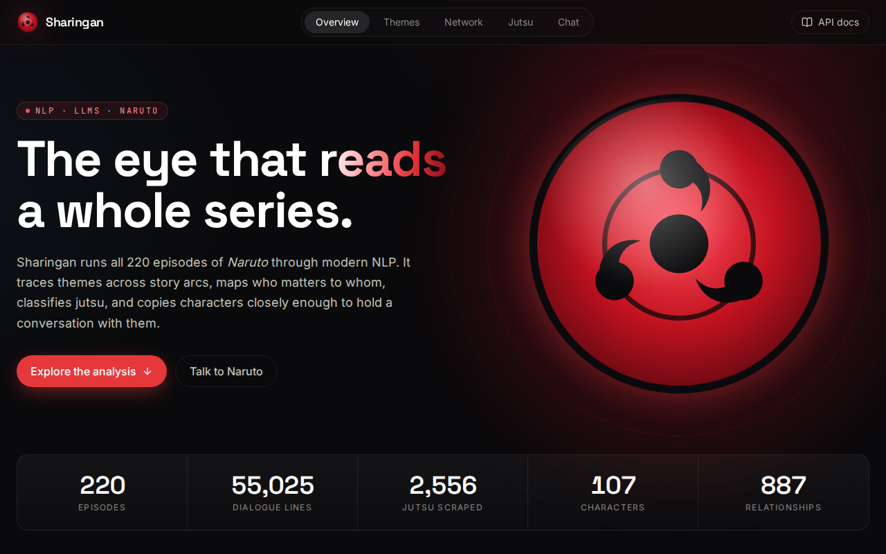 |  |
| **Themes** | **Jutsu classifier** |
| 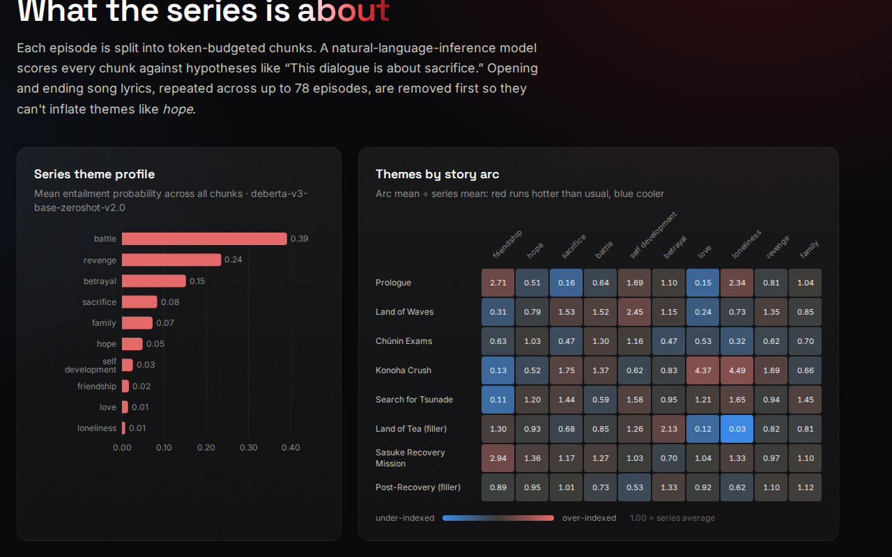 | 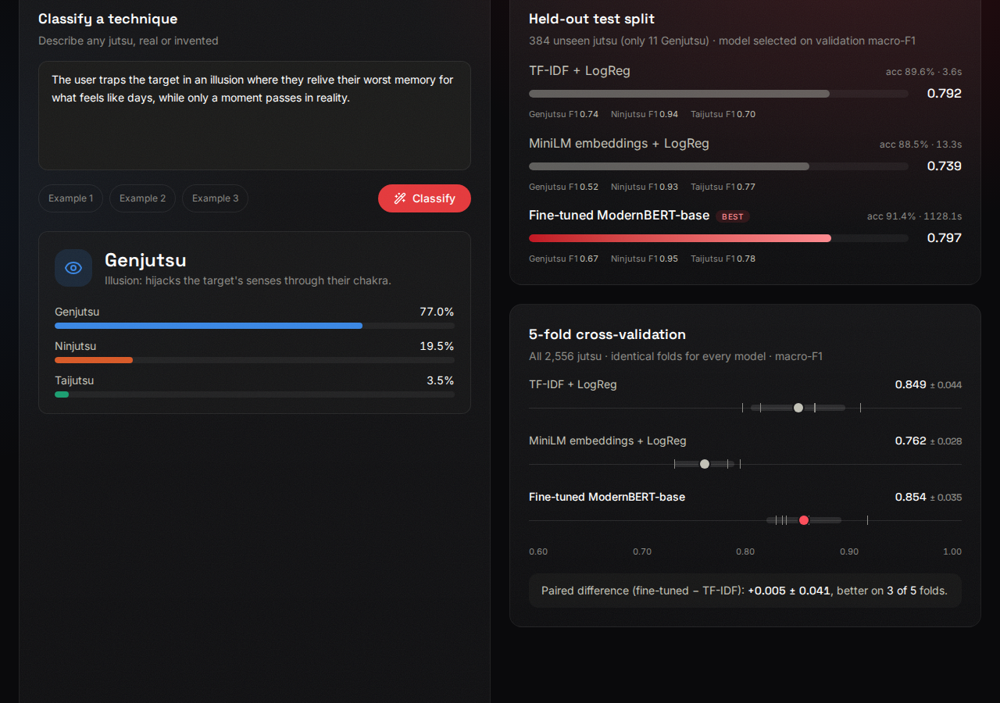 |
| **Chat** | |
| 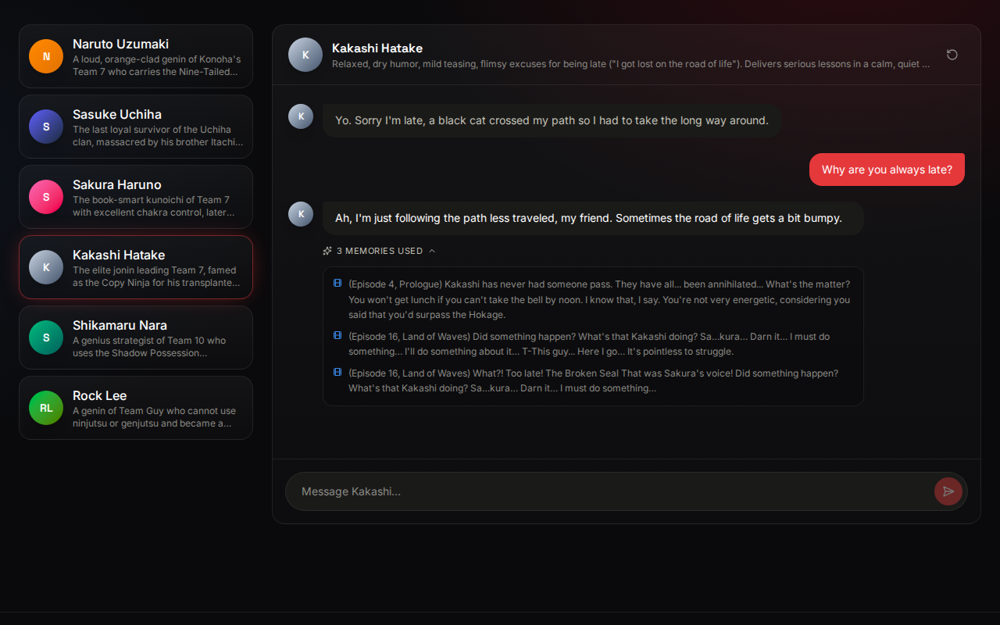 | |

All images and GIFs are produced by `scripts/capture_media.py` from the running site, so they can
be regenerated after any UI change.

### 11.3 Visual and interaction rules
* **Colour follows the entity.** Communities and themes keep their colour when filters change.
  Communities beyond the eighth fold into a neutral grey.
* **Charts:** a diverging blue ↔ red scale with a neutral midpoint for lift, and a sequential blue
  scale for the confusion matrix.
* **Network graph:**
  * nodes are drawn in ascending PageRank order, with labels in a second pass so no node covers
    a label,
  * hovering dims everything outside the focused character's neighbourhood, and
  * gentle centering forces plus a largest-component filter keep the layout compact.
* **Accessibility:** a reduced-motion mode disables scroll-reveal and animations, and the layout
  works at phone width (390 px) with no horizontal scrolling.
* **Empty states:** each section explains which `sharingan …` command fills it.

---

## 12. Configuration reference

All settings live in `config.yaml`. Any key can be overridden by an environment variable (or
`.env`) named `SHARINGAN__<SECTION>__<KEY>`, with the value parsed as YAML.

| Section | Key | Default | Effect |
|---|---|---|---|
| `paths` | `subtitles_dir`, `transcript_csv`, `jutsus_jsonl`, `jutsus_fallback_jsonl`, `processed_dir`, `outputs_dir` | see file | Data locations |
| `subtitles` | `song_min_episodes` | 5 | Episodes a line must repeat in to count as a lyric |
| | `song_window_seconds` | 150 | Opening/ending window in which a lyric must fall |
| `themes` | `model_name` | `MoritzLaurer/deberta-v3-base-zeroshot-v2.0` | NLI model |
| | `hypothesis_template` | `This dialogue is about {}.` | Hypothesis wording |
| | `labels` | 10 themes | Default themes |
| | `chunk_max_tokens` / `batch_size` | 320 / 32 | Chunk size and NLI batch size |
| `characters` | `spacy_model` | `en_core_web_trf` | NER model |
| | `window_lines` / `decay_tau` | 10 / 4.0 | Co-occurrence window and decay |
| | `min_mentions` / `top_edges` | 8 / 250 | Node threshold and edges drawn |
| `jutsu` | `model_name` | `answerdotai/ModernBERT-base` | Encoder to fine-tune |
| | `labels` | Genjutsu, Ninjutsu, Taijutsu | Classes |
| | `max_length`, `epochs`, `learning_rate`, `batch_size`, `seed` | 256, 4, 5e-5, 16, 42 | Training settings |
| | `hub_model_id` | null | Push target on the Hugging Face Hub |
| `persona` | `base_model` | `Qwen/Qwen2.5-3B-Instruct` | Chat LLM |
| | `embedding_model` | `all-MiniLM-L6-v2` | Retrieval encoder |
| | `adapter_dir` | `outputs/models/persona-lora` | Where adapters are auto-loaded from |
| | `retrieved_examples`, `max_new_tokens`, `temperature`, `top_p` | 4, 160, 0.7, 0.9 | Retrieval and generation settings |

---

## 13. Outputs reference

```text
data/processed/dialogue.parquet            Task 0  clean line-level dialogue (55,025 rows)
outputs/themes/episodes.parquet            Task 2  220 × theme scores
outputs/themes/chunks.parquet              Task 2  1,625 scored chunks
outputs/characters/mentions.parquet        Task 3  9,913 mentions
outputs/characters/edges.parquet           Task 3  887 weighted edges
outputs/characters/metrics.parquet         Task 3  107 characters × centralities
outputs/characters/network.html            Task 3  standalone interactive graph
outputs/models/jutsu/model/                Task 4  fine-tuned ModernBERT (HF format)
outputs/models/jutsu/reports/metrics.json  Task 4  held-out comparison
outputs/models/jutsu/reports/crossval.json Task 4  5-fold comparison
outputs/persona/memory/                    Task 5  voice/scene tables + embeddings
outputs/experiments/persona-lora-naruto-v1 Task 5  rejected adapter + sft/eval reports
outputs/logs/*.log                         run logs (crawl, themes, characters, jutsu, cv, persona, app)
```

---

## 14. Testing, reproducibility and hardware

### 14.1 Tests
`pytest` runs 35 fast unit tests with no model downloads:

| File | Covers |
|---|---|
| `test_ingest.py` | ASS/SRT parsing, tag stripping, lyric rule, arc coverage, label priority, stage directions |
| `test_scraping.py` | Infobox fields, prose extraction, interlanguage-link removal |
| `test_characters.py` | 12 alias-resolution cases, exponential-decay weights, window boundaries, no cross-episode links, metrics |
| `test_models_and_config.py` | Stratified disjoint splits, class weights, evaluation, voice/scene tables, env overrides |
| `test_persona_prompting.py` | Retrieval ranking, demo-turn assembly, voice restated last, the verdict rejecting parroting |

### 14.2 Reproducibility
* Fixed seeds (`seed_everything`, seeded splits, seeded Louvain).
* Every stage caches its outputs, and `--refresh` recomputes.
* Run logs are kept in `outputs/logs/`.

### 14.3 Hardware notes
| Stage | CPU time (24-core Intel Core Ultra 9 285K) |
|---|---|
| Scrape | about 1 min (62 requests) |
| Themes | about 35 min (16,250 NLI pairs) |
| Character NER | about 3.5 min |
| Jutsu fine-tune | about 19 min (single split); about 16 min per CV fold |
| Persona memory | about 1–3 min (13.6k embeddings) |
| Persona LoRA (3B, 2 epochs) | about 20 min |
| Chat | first token about 2 s, about 2 words/s |

**GPU:** the machine has an NVIDIA RTX PRO 5000 (72 GB). Its modules are installed for kernel
`7.0.0-38`, but the system runs `7.0.0-34`. Reboot into 7.0.0-38, or install
`linux-modules-nvidia-595-open-7.0.0-34-generic`. Every stage then switches to CUDA automatically.

---

## 15. Known limitations and future work

| Area | Limitation | Possible next step |
|---|---|---|
| Data | No speaker labels in subtitles | Speaker diarisation from audio, or more scraped transcripts |
| Themes | Dialogue-only signal; wording-sensitive scores | Calibrate hypotheses on a small labelled set; ensemble several templates |
| Network | Mentions ≠ presence | Combine with scene-level co-presence from transcripts |
| Jutsu | Single-label simplification of multi-label truth | Multi-label head over all wiki classifications |
| Chat | LoRA failed because of biased weak labels | Train on speaker-attributed data; add a relevance-aware reward (DPO) |
| Scale | CPU-bound | Fix the GPU driver; use Llama-3-8B in 4-bit for chat |

---

## 16. Glossary
| Term | Meaning |
|---|---|
| **NLI** | Natural Language Inference: does a premise entail a hypothesis? |
| **Zero-shot classification** | Classifying into labels the model was never trained on, here via NLI hypotheses |
| **NER** | Named-Entity Recognition: finding spans such as PERSON in text |
| **Gazetteer / EntityRuler** | A list of known names matched by rules before the statistical NER |
| **Zipf frequency** | log10 of a word's frequency per billion words; above 3 means a common English word |
| **PageRank** | Importance of a node, from the importance of its neighbours |
| **Betweenness** | How often a node lies on shortest paths between others |
| **Louvain** | Community detection by greedy modularity optimisation |
| **Macro-F1** | Unweighted mean of per-class F1, insensitive to class frequency |
| **Stratified k-fold** | k train/test splits that preserve class proportions in every fold |
| **RAG** | Retrieval-Augmented Generation: retrieve relevant text and add it to the LLM prompt |
| **LoRA / QLoRA** | Low-rank adapter fine-tuning; QLoRA does it over a 4-bit quantised base model |
| **SSE** | Server-Sent Events: a one-way HTTP stream used for token streaming |
| **Lift** | Ratio of a subgroup's mean to the overall mean (1.0 = average) |

---

## Appendix A: Training and fine-tuning procedures, step by step

This appendix walks through every training run in the project in execution order, as the code
actually performs it, with the numbers observed on this machine. There are three kinds of training:

| Procedure | What is trained | Parameters updated | Command |
|---|---|---|---|
| A.3 Baselines | TF-IDF / embedding + logistic regression | Linear weights only | part of `sharingan jutsu train` |
| A.4 Full fine-tuning | ModernBERT-base encoder + new classification head | **All** ~149M | `sharingan jutsu train` |
| A.5 Cross-validation | The three models above, once per fold | as above | `sharingan jutsu cv` |
| A.6 Parameter-efficient fine-tuning | LoRA adapter on Qwen2.5-3B-Instruct | **29.9M (0.97%)**, base frozen | `sharingan persona train` |
| A.7 Adapter acceptance test | nothing (evaluation) | none | `sharingan persona eval` |

### A.1 Prerequisites

```bash
# 1. Environment (Python 3.12 recommended; the project was run on 3.12.14)
conda create -n naruto-nlp python=3.12 -y
conda activate naruto-nlp

# 2. Install the package, test tools, spaCy model and web dependencies
make install          # pip install -e ".[dev]"  +  spacy download en_core_web_trf  +  npm install

# 3. (GPU only) 4-bit quantisation support for QLoRA / 8B chat models
pip install -e ".[gpu]"          # bitsandbytes

# 4. Check which device will be used (each stage picks it automatically)
python -c "from sharingan.core import pick_device; print(pick_device())"   # cuda | mps | cpu

# 5. Optional: a Hugging Face token (rate limits, gated models such as Llama 3, pushing models)
cp .env.example .env && edit .env       # HF_TOKEN=...
```

Version floors matter. The code targets the **transformers 5 / TRL 1** APIs (`processing_class`,
`eval_strategy`, `compute_loss_func`, float `warmup_steps`; see A.9).

### A.2 Preparing the jutsu training data

| Step | Action | Code | Result |
|---|---|---|---|
| 1 | Scrape the wiki through the MediaWiki API | `sharingan scrape` | `data/raw/jutsus.jsonl`, 2,717 records |
| 2 | Load and normalise both possible schemas | `ingest.load_jutsus` | `name, classes, description` |
| 3 | Assign the primary label (Genjutsu > Ninjutsu > Taijutsu) | `primary_label` | label or `None` |
| 4 | Drop unlabelled records, descriptions ≤ 20 characters and duplicate names | `load_jutsus` | **2,556** examples |
| 5 | Build the model input `text = name + ". " + description` | `load_jutsus` | e.g. "Rasengan. The Rasengan is a jutsu that…" |
| 6 | Stratified 70/15/15 split, `random_state = 42` | `models.jutsu.make_splits` | train **1,788** / val **384** / test **384** |

Stratification keeps the class ratio (81/16/3%) identical in every split. The test split is
created first, so it is never influenced by later choices.

### A.3 Baseline training

Both baselines train on the **train** split only and are scored once on **test**. They have no
hyperparameter search, so they don't need the validation split.

**TF-IDF + logistic regression** (`baselines.tfidf_logreg`)
1. Fit two vectorisers on the training texts and concatenate their features (`make_union`):
   * word 1–2-grams, `min_df = 2`, sublinear TF, English stop words removed, and
   * character 3–5-grams within word boundaries (`char_wb`), `min_df = 3`, sublinear TF. These
     capture morphemes like "-jutsu" and "Release:".
2. Fit `LogisticRegression(C = 8, class_weight = "balanced", max_iter = 3000)`.
3. Predict on test and compute accuracy, macro-F1, the per-class report and the confusion matrix.
   This takes about 4 s.

**Sentence embeddings + logistic regression** (`baselines.embedding_logreg`)
1. Encode every text with `all-MiniLM-L6-v2` into 384-d L2-normalised vectors (batch 64).
2. Fit `LogisticRegression(C = 4, class_weight = "balanced")` on the train vectors.
3. Score on test. This takes about 13 s, most of it encoding.

### A.4 Full fine-tuning of the jutsu classifier (ModernBERT-base)

**Code:** `models/jutsu/trainer.py :: JutsuTrainer.fit` · **Command:** `sharingan jutsu train`
(add `--model <hf-id>` to try another encoder, `--epochs N`, or `--push` with `jutsu.hub_model_id` set)

**Step 1: Seed everything.** `seed_everything(42)` seeds Python, NumPy and PyTorch, and sets
`PYTHONHASHSEED`, so the shuffling, dropout and classifier-head initialisation are reproducible.

**Step 2: Compute class weights** from the *training* split with scikit-learn's "balanced" formula:

$$ w_c = \frac{N}{K \cdot N_c} \quad\Rightarrow\quad w_{\text{Genjutsu}} = 11.04,\; w_{\text{Ninjutsu}} = 0.41,\; w_{\text{Taijutsu}} = 2.11 $$

($N$ = 1,788 training examples, $K$ = 3 classes, $N_c$ = class count.) A Genjutsu mistake now
costs about 27× a Ninjutsu mistake.

**Step 3: Tokenise.**
* Load the ModernBERT tokenizer and map labels to ids (`Genjutsu: 0, Ninjutsu: 1, Taijutsu: 2`).
* Tokenise with `truncation=True, max_length=256`. The token lengths of the texts are median 59,
  90th percentile 178 and maximum 4,413, so only **5.6%** of examples are truncated, keeping the
  name and the opening description.
* No padding happens at this point. `DataCollatorWithPadding` pads each batch to its own longest
  example later (dynamic padding).

**Step 4: Initialise the model.**
* `AutoModelForSequenceClassification.from_pretrained("answerdotai/ModernBERT-base", num_labels=3, id2label, label2id)`
  loads the pretrained encoder and adds a **new, randomly initialised 3-way classification head**.
* Every parameter, encoder and head alike, is trainable. This is *full* fine-tuning.

**Step 5: Define the loss.**
* The weighted cross-entropy is passed to `Trainer` as `compute_loss_func`, which avoids
  subclassing `Trainer`:

$$ \mathcal{L} = -\frac{\sum_i w_{y_i} \log \operatorname{softmax}(z_i)_{y_i}}{\sum_i w_{y_i}} $$

* Logits are cast to fp32 before the loss for numerical safety under bf16.

**Step 6: Configure optimisation** (`TrainingArguments`).

| Setting | Value | Why |
|---|---|---|
| Optimiser | AdamW (fused when available) | Default for transformer fine-tuning |
| Peak learning rate | 5e-5 | Standard for base-size encoders |
| Weight decay | 0.01 | Mild regularisation |
| Warm-up | `warmup_steps = 0.1`, i.e. 10% of 448 steps ≈ **45 steps** | Protects the pretrained weights from the random head's early gradients |
| Schedule | cosine decay to 0 | Smooth annealing |
| Batch size | 16 train / 32 eval | Fits CPU RAM; dynamic padding keeps batches small |
| Epochs | up to 4, so **112 steps per epoch, 448 steps total** | |
| Precision | fp32 on CPU, **bf16 automatically on CUDA** | |
| Evaluate / save | every epoch, keeping only the best checkpoint | Needed for early stopping |
| Model selection | `metric_for_best_model = "macro_f1"`, `load_best_model_at_end` | Accuracy would hide Genjutsu failures |
| Early stopping | `EarlyStoppingCallback(patience = 2)` | Stops after 2 epochs without improvement |

**Step 7: Train.** Each step runs forward, weighted loss, backward and an AdamW update. The
observed loss fell from about 1.04 to about 0.93 within the first half epoch, at about 2.3 s per
step on CPU.

**Step 8: Validate every epoch.** Macro-F1 and accuracy are computed on the 384 validation examples:

| Epoch | Validation macro-F1 | |
|---|---|---|
| 1 | 0.782 | |
| **2** | **0.856** | ← best, kept |
| 3 | 0.835 | no improvement (patience 1/2) |
| 4 | 0.838 | no improvement (patience 2/2; also the last epoch) |

**Step 9: Restore the best checkpoint.** `load_best_model_at_end` reloads the epoch-2 weights.

**Step 10: Run the single test evaluation.** `trainer.predict(test)`, argmax over logits, then
`evaluate()`. The result was macro-F1 **0.797**, accuracy **0.914**, confusion matrix
`[[6,5,0],[1,298,13],[0,14,47]]`. The test split is used exactly once.

**Step 11: Persist.**
* `outputs/models/jutsu/model/`: `model.safetensors` + config, tokenizer files, and
  `training_report.json`, together 602 MB.
* `outputs/models/jutsu/reports/metrics.json`: data sizes, label counts, both baselines and the
  transformer.
* The intermediate `checkpoints/` directory (optimizer state, ~1.7 GB) is deleted automatically.

**Step 12 (optional): Publish.** Set `jutsu.hub_model_id`, export `HF_TOKEN`, then run
`sharingan jutsu train --push`.

**Step 13: Use it.**
```bash
sharingan jutsu predict "A spinning sphere of wind chakra driven into the enemy"
# {"Ninjutsu": 0.9…, "Taijutsu": …, "Genjutsu": …}
```
The API (`POST /api/jutsu/classify`) and the website load the same directory.

**Timing:** 1,128 s (19 min) on the 24-core CPU. Expect roughly 1–2 minutes on a modern GPU.

### A.5 Cross-validation procedure

**Code:** `models/jutsu/crossval.py` · **Command:** `sharingan jutsu cv --folds 5 --epochs 3`
(`--no-transformer` runs the baselines only, in about 5 minutes)

1. **Build folds.** `StratifiedKFold(n_splits=5, shuffle=True, random_state=42)` over all 2,556
   examples. Each fold's test part has about 511 examples, including about 15 Genjutsu.
2. **For each fold k:**
   1. The test part is fold k and the training part is the other four folds (about 2,045 examples).
   2. Carve a stratified 15% validation set out of the training part (`random_state = 42`), used
      only by the transformer for early stopping and best-epoch selection.
   3. Train TF-IDF + LogReg and MiniLM + LogReg on the **whole** training part (train + val), since
      they have no model selection.
   4. Train ModernBERT exactly as in A.4 (with `epochs = 3`), writing to a temporary
      `outputs/models/jutsu/cv/fold_k/` that is deleted afterwards (`fit(save=False)`, so the
      production model is never overwritten).
   5. Score all three models on the same test fold.
3. **Aggregate.** Report mean ± sample standard deviation of macro-F1, accuracy and per-class F1
   for each model.
4. **Compare pairwise.** Compute the per-fold difference (ModernBERT − TF-IDF), its mean ± std,
   and the number of folds won. Because every model sees identical folds, fold difficulty cancels out.
5. **Save** `outputs/models/jutsu/reports/crossval.json`. The website's Jutsu section displays it
   automatically.

**Timing:** about 16 minutes per fold on CPU, about 80 minutes for 5 folds.

### A.6 Parameter-efficient fine-tuning of a character (LoRA / QLoRA)

**Code:** `models/persona/sft.py` · **Command:** `sharingan persona train --character Naruto --epochs 2`

**Step 1: Build the retrieval memory** (`sharingan persona memory`). This produces the
`(context, line, source)` voice table, 188 exchanges across characters (§9.3).

**Step 2: Select the training exchanges** (`build_sft_dataset`). Keep rows where
`character == "Naruto"`, the context is non-empty and the reply has at least 3 words: **120
exchanges**, 27 from the transcript and 93 weakly attributed from subtitles.

**Step 3: Format them as conversational prompt–completion records.**
```json
{"prompt":     [{"role": "system", "content": "<Naruto card, no retrieval>"},
                {"role": "user",   "content": "Oh yeah, Naruto!?"}],
 "completion": [{"role": "assistant", "content": "Where'd you come from, Iruka Sensei!? What are you doing here?"}]}
```
The system prompt matches the one used at inference (minus retrieved memories), so training and
serving see the same framing.

**Step 4: Split.** `train_test_split(test_size=0.1, seed=42)` gives **108 train / 12 eval**. The
split happens only when there are at least 40 examples; otherwise everything is used for training
and evaluation is skipped.

**Step 5: Load the tokenizer and base model** (`load_causal_lm`).
* The pad token falls back to EOS if the tokenizer has none.
* **CPU:** fp32 weights (Qwen2.5-3B ≈ 12 GB of RAM).
* **CUDA:** bf16 with `device_map="auto"`. Models of 7B and above automatically get
  `BitsAndBytesConfig(load_in_4bit=True, bnb_4bit_quant_type="nf4", bnb_4bit_compute_dtype=bf16)`,
  which is **QLoRA**.
* `model.config.use_cache = False`, because the KV cache is useless during training and conflicts
  with gradient checkpointing.

**Step 6: Attach the LoRA adapters** (`LoraConfig`). For every linear layer
(`q_proj, k_proj, v_proj, o_proj, gate_proj, up_proj, down_proj`) in all 36 transformer blocks,
the frozen weight $W$ is augmented with a trainable low-rank update:

$$ W' = W + \frac{\alpha}{r} B A, \qquad A \in \mathbb{R}^{r \times d_{in}},\; B \in \mathbb{R}^{d_{out} \times r},\; r = 16,\; \alpha = 32 $$

* $B$ is initialised to zero, so training starts exactly from the base model's behaviour.
* LoRA dropout is 0.05 and no biases are trained.
* Trainable parameters: **29,933,568, which is 0.97% of 3.09B**. The base weights stay frozen.

**Step 7: Configure training** (`SFTConfig`).

| Setting | Value |
|---|---|
| Learning rate | 2e-4 (typical for LoRA, about 10× full fine-tuning) |
| Schedule | cosine, `warmup_steps = 0.1` (10%) |
| Batch | 4 per device × **gradient accumulation 2 = effective 8** |
| Steps | 108 / 4 = 27 micro-batches → **14 optimiser steps per epoch, 28 for 2 epochs** |
| Max sequence length | 512 tokens (an example is ~369 tokens, mostly the system prompt) |
| Gradient clipping | `max_grad_norm = 0.3` (stabilises small-batch LoRA) |
| Loss masking | `completion_only_loss = True`: only the ~18 reply tokens of each example are scored, so the model never learns to reproduce the prompt |
| Precision | fp32 on CPU; bf16 + gradient checkpointing on CUDA |
| Evaluation | each epoch on the 12 held-out exchanges |
| Checkpoints | none mid-run (`save_strategy="no"`); the adapter is saved at the end |

**Step 8: Measure the base model first.** `trainer.evaluate()` runs *before* any update, giving the
base model's held-out loss: **3.73**, the bar the adapter must beat.

**Step 9: Train.** TRL renders each record with the model's chat template, masks the prompt tokens,
and optimises only the LoRA matrices. Observed on CPU, at about 37 s per optimiser step:

| Point | Train loss (logged every 5 steps) | Eval loss |
|---|---|---|
| before training | n/a | 3.73 (base model) |
| step 5 | 3.46 | |
| step 10 | 2.44 | |
| end of epoch 1 (step 14) | | 2.13 |
| step 15 | 2.15 | |
| step 20 | 2.02 | |
| step 25 | 1.91 | |
| end of epoch 2 (step 28) | 2.36 (mean over the whole run) | **2.04** |

Total: about 20 minutes on CPU (a few minutes on a GPU).

**Step 10: Save** to `outputs/models/persona-lora/<Character>/`:
* `adapter_model.safetensors` (120 MB) and `adapter_config.json`,
* tokenizer files with the chat template, and
* `sft_report.json` containing `train_loss, examples, base_model, epochs, lora_rank, base_eval_loss, eval_loss`.

**Step 11: Run the acceptance test.** `sharingan persona eval --character Naruto` performs the A/B
test of A.7. **A lower loss is not sufficient**: the Naruto adapter cut eval loss by 45%, yet it
failed acceptance.

**Step 12: Deploy or archive.**
* **Accepted:** leave the adapter in `outputs/models/persona-lora/<Character>/`. `PersonaEngine`
  loads every adapter directory it finds with PEFT (`PeftModel.from_pretrained`, then
  `load_adapter`), and activates it with `set_adapter(<Character>)` only when that character is
  chatting. Other characters run with `disable_adapter()`. Restart `sharingan app` to pick it up.
* **Rejected:** move it to `outputs/experiments/`. This is what happened with
  `persona-lora-naruto-v1`.

**GPU / QLoRA recipe (Llama 3 8B):**
```bash
# needs a CUDA GPU, `pip install -e ".[gpu]"`, and HF_TOKEN with access to the gated Llama 3 repo
export SHARINGAN__PERSONA__BASE_MODEL=meta-llama/Meta-Llama-3-8B-Instruct
sharingan persona train --character Naruto --epochs 2      # 4-bit NF4 base + bf16 LoRA (QLoRA)
sharingan persona eval  --character Naruto                 # accept or reject
sharingan app                                              # serves with the same base model
```
The adapter is tied to the base model it was trained on. Serving must use the same `base_model`.

### A.7 Adapter acceptance test (A/B evaluation)

**Code:** `models/persona/evaluate.py` · **Command:** `sharingan persona eval --character <Name>`

1. Load the engine with the adapter.
2. For each of the 10 held-out prompts, which are written fresh and absent from the training data:
   1. run retrieval **once** with `prepare()`, so both arms receive identical messages,
   2. generate the **base** reply with `torch.manual_seed(7)` and `use_adapter=False`, and
   3. generate the **LoRA** reply with the same seed and `use_adapter=True`.
3. Embed all replies and prompts with MiniLM, then compute `voice_similarity`, `distinctiveness`,
   `relevance`, `catchphrase_rate` and `words` for each arm (§9.5).
4. Apply the verdict rule: more distinctive **and** relevance ≥ 90% of base **and** length ≥ 50% of
   base **and** catchphrase rate ≤ 75%.
5. Write `eval_report.json` (metrics, verdict, all side-by-side samples) next to the adapter and
   print the table and the samples.

### A.8 Tuning guide

| Goal | Knob | Where |
|---|---|---|
| Better rare-class recall (classifier) | Raise the Genjutsu weight, or oversample it | `data.class_weights` |
| Faster classifier experiments | `--model distilbert/distilbert-base-uncased`, `--epochs 2` | CLI |
| Longer descriptions | `jutsu.max_length` (5.6% are truncated at 256) | `config.yaml` |
| Less LoRA over-fitting | fewer epochs, lower `rank` (8), higher dropout, more diverse data | `train_persona_adapter` args |
| A LoRA that keeps substance | remove catchphrase-selected targets, add transcript data, mix in the base model's own good replies | `build_sft_dataset` |
| Reproducibility checks | change `jutsu.seed`, re-run `jutsu cv` | `config.yaml` |

### A.9 Troubleshooting (issues actually hit during development)

| Symptom | Cause | Fix used |
|---|---|---|
| `TypeError: … unexpected keyword argument 'warmup_ratio'` | transformers 5 removed `warmup_ratio` | `warmup_steps=0.1` (a float is read as a ratio) |
| `… 'group_by_length'` | removed in transformers 5 | Option dropped; dynamic padding is enough |
| `tokenizer=` rejected by `Trainer` | renamed in v5 | `processing_class=tokenizer` |
| Need a weighted loss without subclassing | | `Trainer(compute_loss_func=…)` |
| A training job was killed partway through | the session's 30-minute / 2-hour background limit | Run long jobs detached (`setsid nohup … &`); the theme analysis resumes from its checkpoint |
| Training several times slower than expected | Two CPU-heavy jobs competing for 24 cores | Run heavy stages one at a time (LoRA went from ~170 s to ~40 s per step) |
| `nvidia-smi` cannot reach the driver | NVIDIA modules built only for kernel 7.0.0-38 | See §14.3 |
| Chat model 401 / gated | Llama 3 needs an accepted licence + `HF_TOKEN` | Accept on the Hub, set the token in `.env` |
