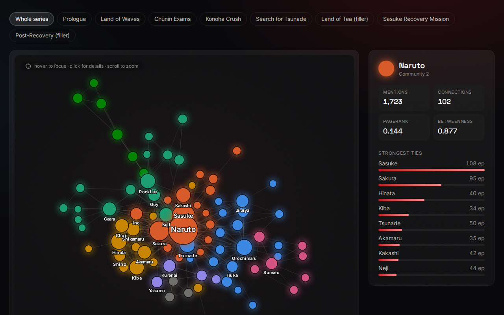
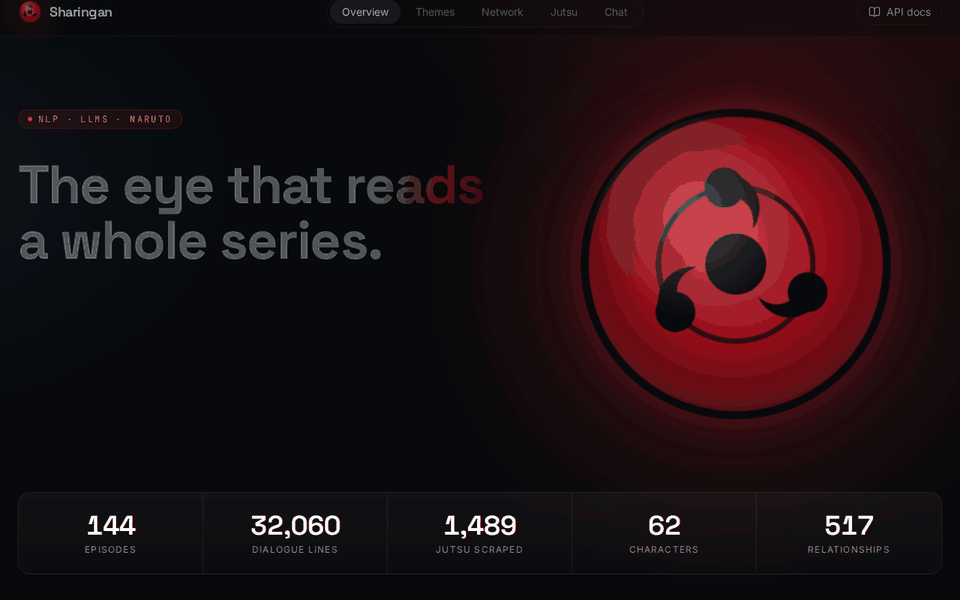
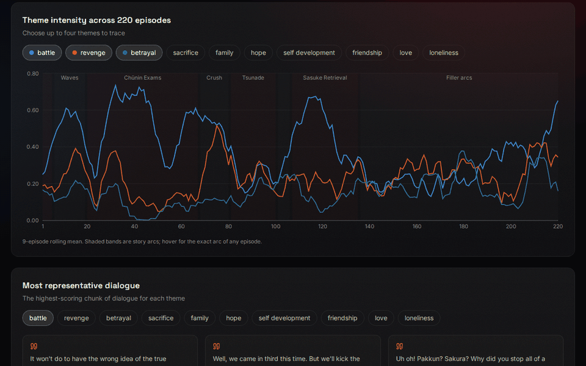
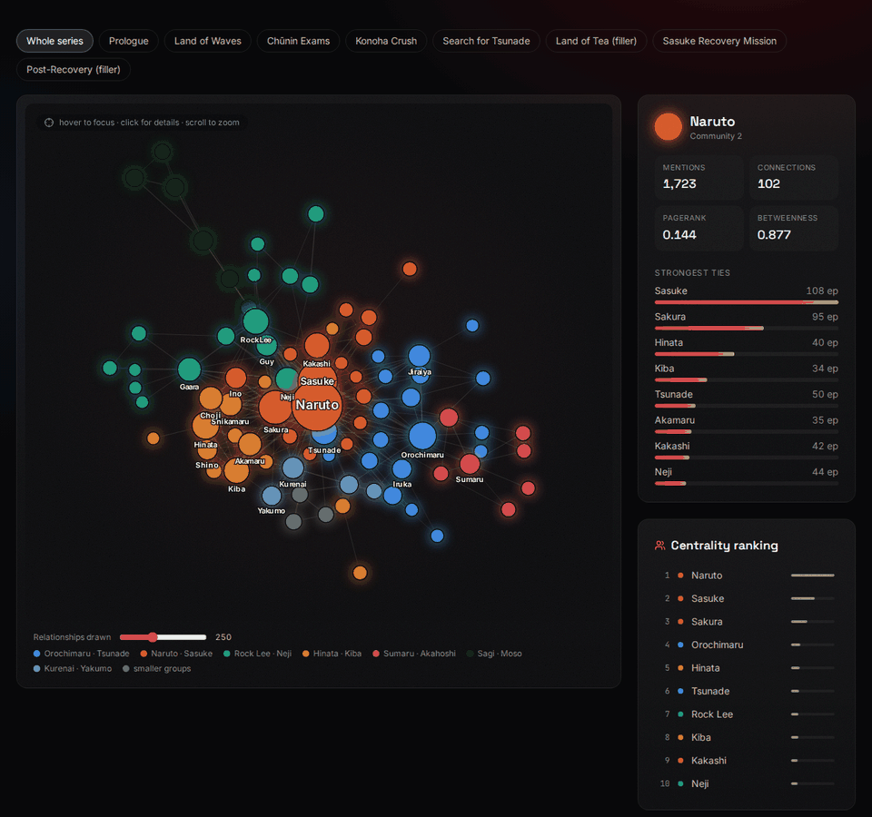
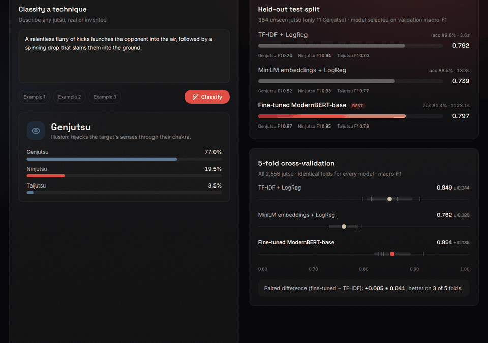
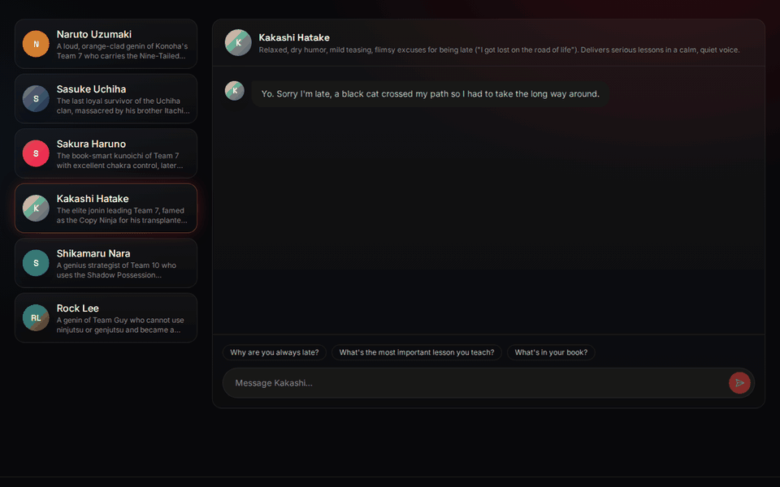
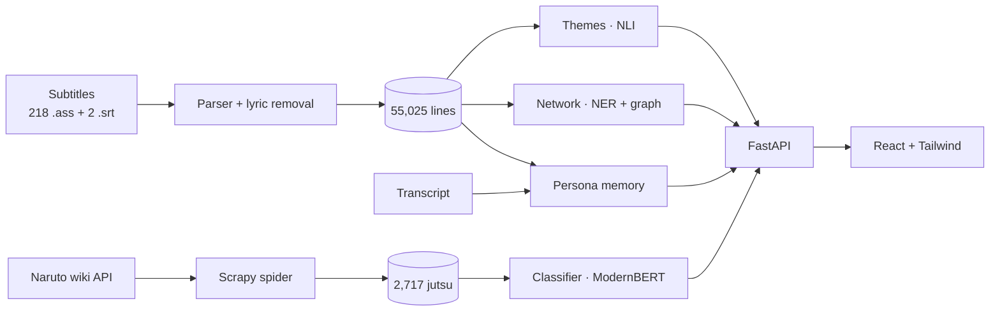

<div align="center">



<br /><br />


# Sharingan

**The eye that reads a whole series.**

An end-to-end NLP and LLM system that runs all 220 episodes of *Naruto* through modern language models.
It traces themes across story arcs, maps who matters to whom, classifies jutsu, and copies characters well
enough to hold a conversation with them, all presented in a React + Tailwind web app.

<p>
  
  
  
  
  
  
  
  
</p>

<a href="#a-tour-of-the-app">Tour</a> ·
<a href="#results">Results</a> ·
<a href="#quick-start">Quick start</a> ·
<a href="#architecture">Architecture</a> ·
<a href="Anatomy.md">Full documentation</a>

<br /><br />



<sub><i>The character network: 107 characters and 887 relationships extracted with NER, sized by PageRank and coloured by Louvain community.</i></sub>

</div>

---

## What it does

| | Stage | What it answers | How |
|:-:|---|---|---|
| 🕸️ | **Scrape** | What jutsu exist, and how are they classified? | Scrapy on the MediaWiki Action API: 2,717 articles in 62 requests |
| 🎭 | **Themes** | What is each episode and arc *about*? | Zero-shot NLI (DeBERTa-v3) over 16,250 chunk × theme pairs |
| 👥 | **Network** | Who matters, who is close, which groups form? | spaCy transformer NER + gazetteer → NetworkX (PageRank, betweenness, Louvain) |
| 🌀 | **Classify** | Is a technique Ninjutsu, Genjutsu or Taijutsu? | Fine-tuned ModernBERT vs. TF-IDF and embedding baselines, with 5-fold CV |
| 💬 | **Chat** | What would Naruto, Sasuke or Kakashi say? | Retrieval-augmented Qwen2.5-3B with voice + scene memory, streamed over SSE |

---

## A tour of the app

### 1 · Landing page


The entrance animation introduces the corpus: **220 episodes, 55,025 dialogue lines, 2,556 labelled
jutsu, 107 characters and 887 relationships**. Every number is read live from the API. Below the
stats, the five pipeline stages are listed with the exact model each one uses.

<br />

### 2 · Themes: what the series is about


Each episode is packed into token-budgeted chunks of whole subtitle lines, and an NLI model scores every
chunk against hypotheses such as *"This dialogue is about sacrifice."*

- **Series profile:** which themes dominate overall (battle, revenge, betrayal).
- **Arc heatmap:** the lift of each theme per story arc, where red means hotter than average.
- **Trajectory:** up to four themes traced across all 220 episodes, with story arcs shaded behind them.
- **Representative dialogue:** the chunk that scored highest for each theme.
- **Theme lab:** type your own themes and score them live on any range of episodes.

> Opening and ending song lyrics, repeated across up to 78 episodes, are detected and removed first,
> so they can't inflate themes like *hope*.

<br />

### 3 · Character network: who matters to whom


spaCy's transformer NER, backed by a 71-character gazetteer with 129 aliases, finds every name. Alias
resolution maps "Pervy Sage" → Jiraiya and "Sasuke-kun" → Sasuke. Two characters are linked when they
are named within 10 subtitle lines of each other, weighted by `exp(−distance/τ)`.

- **Focus:** click or hover a character to light up their neighbourhood and see their strongest ties.
- **Filter by arc:** the graph is rebuilt for each story arc, shown here for the Chūnin Exams.
- **Communities found without supervision:** Team 7, the Sannin, the rookie teams, Lee · Neji · Gaara,
  and one community per filler arc. The legend names each community after its most central members.

<br />

### 4 · Jutsu classifier: Ninjutsu, Genjutsu or Taijutsu?


Describe any technique, real or invented, and a fine-tuned **ModernBERT** returns class probabilities.
Next to it, the page reports the evaluation honestly:

- the held-out test leaderboard against TF-IDF and embedding baselines,
- **5-fold cross-validation** with a per-fold spread and a paired comparison,
- a confusion matrix, and
- the class distribution (Genjutsu is only 3% of the data, which is why macro-F1 is the headline
  metric).

<br />

### 5 · Chat with a character


Pick a shinobi and talk. Each reply comes from **Qwen2.5-3B-Instruct**, which is grounded in two
retrieval memories:

- **Voice memory:** lines the character really said, from the transcript and from catchphrase-matched
  subtitles.
- **Scene memory:** 13,453 windows of dialogue from all 220 episodes.

The best-matching real exchanges are replayed as few-shot turns, and tokens stream over server-sent
events. Expand **"memories used"** under any reply to see exactly what grounded it.

---

## Results

<details open>
<summary><b>Themes</b>: the per-arc lift follows the story, with no story labels used</summary>

| Arc | Strongest lift (× series average) |
|---|---|
| Prologue | friendship ×2.7, loneliness ×2.3 (Naruto the outcast) |
| Land of Waves | self development ×2.5, sacrifice ×1.5 (Haku and Zabuza) |
| Konoha Crush | loneliness ×4.5, love ×4.4 (Gaara's backstory), sacrifice ×1.8 (the Third Hokage) |
| Sasuke Recovery Mission | friendship ×2.9 |

</details>

<details open>
<summary><b>Character network</b>: 9,913 mentions → 107 characters, 887 relationships</summary>

- **Naruto** has PageRank 0.144 and betweenness 0.877, so he bridges almost every path.
- The strongest tie is **Naruto–Sasuke**: 875 co-occurrences across 108 episodes.
- The NER model discovered filler characters that no cast list contains: Yakumo, Sumaru, Idate,
  Menma and Raiga.

</details>

<details open>
<summary><b>Jutsu classifier</b>: held-out test split and 5-fold cross-validation</summary>

| Model | Test macro-F1 | Test accuracy | Train time (CPU) |
|---|---|---|---|
| TF-IDF (word + char) + LogReg | 0.792 | 0.896 | 4 s |
| MiniLM embeddings + LogReg | 0.739 | 0.885 | 13 s |
| **Fine-tuned ModernBERT-base** | **0.797** | **0.914** | 19 min |

**5-fold cross-validation** over all 2,556 jutsu, with identical folds for every model:

| Model | Macro-F1 | Accuracy | Genjutsu F1 | Taijutsu F1 |
|---|---|---|---|---|
| TF-IDF (word + char) + LogReg | 0.849 ± 0.044 | 0.917 ± 0.025 | **0.831** | 0.766 |
| MiniLM embeddings + LogReg | 0.762 ± 0.028 | 0.866 ± 0.009 | 0.665 | 0.708 |
| **Fine-tuned ModernBERT-base** | **0.854 ± 0.035** | **0.923 ± 0.013** | 0.826 | **0.784** |

ModernBERT and TF-IDF are **statistically tied**: the paired difference is +0.005 ± 0.041 macro-F1, and
ModernBERT won 3 of 5 folds. The transformer is more stable across folds and better on Taijutsu, while
TF-IDF reaches the same level in seconds instead of minutes. The single test split (11 Genjutsu examples)
could not separate them, which is why the CV is reported.

</details>

<details open>
<summary><b>Chat</b>: retrieval beats fine-tuning on tiny, biased data</summary>

- Qwen2.5-3B streams its first token in about 2 s on CPU and holds each voice: Kakashi says *"I got lost
  on the road of life…"* and Sasuke says *"Hmpf. Idiot."*
- A Naruto **LoRA** adapter cut held-out loss from 3.73 to 2.04 but **failed the A/B acceptance test**.
  Its replies shrank to about 7 words, 90% contained the catchphrase, and relevance halved.
- The cause is selection bias in weakly labelled data, so the adapter is archived rather than shipped.
  See [Anatomy §9.6](Anatomy.md#96-results-the-naruto-lora-experiment).

</details>

---

## Quick start

```bash
# 1 · Environment (Python 3.10+, a fresh conda env recommended)
conda create -n sharingan python=3.12 -y && conda activate sharingan
make install                  # pip install -e ".[dev]"  +  spaCy en_core_web_trf  +  npm install

# 2 · Compute every offline stage (CPU works; a CUDA GPU is used automatically)
sharingan all                 # themes → characters → jutsu classifier → persona memory

# 3 · Serve the API + website on one port
make app                      # builds web/dist, then runs: sharingan app  →  http://127.0.0.1:8000
```

`make dev` runs the API on `:8000` and Vite with hot reload on `:5173`. Interactive API docs are at `/docs`.

> **What's in the repository.** Precomputed theme scores, the character network and all evaluation
> reports are included, so the analysis views work straight after cloning. Model weights (the
> 570 MB classifier) and the persona retrieval index are not: `sharingan all` rebuilds them.

<details>
<summary><b>CLI reference</b></summary>

```text
sharingan scrape [--limit N]                    crawl jutsu articles → data/raw/jutsus.jsonl
sharingan themes [--refresh] [--labels "a, b"]  zero-shot theme scores
sharingan characters [--refresh]                NER → character network
sharingan jutsu train [--model ID] [--epochs N] [--push]
sharingan jutsu cv [--folds 5] [--no-transformer]
sharingan jutsu predict "A spinning sphere of wind chakra…"
sharingan persona memory | train | eval | chat  --character Naruto
sharingan all [--skip-jutsu]
sharingan app [--port 8000] [--reload]
```

Every setting lives in [`config.yaml`](config.yaml). Any key can be overridden with
`SHARINGAN__<SECTION>__<KEY>`, e.g. `SHARINGAN__PERSONA__BASE_MODEL=meta-llama/Meta-Llama-3-8B-Instruct`
(on a GPU, models of 7B and above load in 4-bit automatically).

</details>

---

## Architecture



```text
src/sharingan/
  core/        typed config + env overrides, logging, device selection, caching
  ingest/      subtitles (ASS/SRT), transcripts, jutsu records, story arcs
  scraping/    Scrapy spider, item pipelines, pure wikitext parsers
  analysis/    themes.py · characters/ (gazetteer, NER, graph, export)
  models/      jutsu/ (baselines, fine-tuning, CV, inference) · persona/ (cards, memory, engine, LoRA, eval)
  pipeline.py  idempotent stage runners shared by the CLI and the API
  interface/   cli.py (Typer) · api.py (FastAPI + SSE, serves web/dist)
web/src/       sections/ (Hero, Themes, Network, Jutsu, Chat) · lib/ (typed client, palette, hooks)
scripts/       capture_media.py: regenerates every image and GIF in this README
tests/         35 fast unit tests (no model downloads)
```

---

## Design highlights

- **Data quality first.**
  - **Lyrics:** song lyrics are detected by cross-episode repetition *within* the opening and ending
    windows, which removes 9.6% of lines.
  - **Formats:** the parser reads the ASS `Format:` header and also handles the two `.srt` episodes.
  - **Scraping:** it uses the MediaWiki API, because the HTML pages return HTTP 403 to bots.
- **Precise NER.**
  - Case-sensitive gazetteer phrases mean "Guy" the sensei matches but "that guy" doesn't.
  - Names the model discovers must be rare English words (`wordfreq` Zipf < 3).
  - Mention outputs were audited by hand, and non-characters were added to the stoplist.
- **Honest evaluation.** The models are compared against baselines on a test split used exactly once,
  model selection uses macro-F1 under class weighting, and paired 5-fold CV backs up the comparison.
- **Measured LLM changes.** `sharingan persona eval` A/B-tests an adapter on voice, distinctiveness,
  **relevance** and length, because a lower loss alone rewarded catchphrase parroting.
- **Production touches.**
  - Every stage is idempotent and cached, and the theme run resumes from checkpoints.
  - API caches are keyed on file modification times, and chat tokens stream over SSE.
  - The UI honours reduced-motion settings and uses a CVD-validated palette.

The complete write-up, covering datasets, the anatomy of each task, inputs and outputs, and step-by-step
training and fine-tuning procedures, is in **[Anatomy.md](Anatomy.md)**.

---

## Credits

Inspired by [abdullahtarek/analyze_series_with_NLP](https://github.com/abdullahtarek/analyze_series_with_NLP),
whose subtitle and transcript datasets are used here. Jutsu data comes from the
[Naruto Fandom wiki](https://naruto.fandom.com) (CC BY-SA). *Naruto* © Masashi Kishimoto / Shueisha /
Pierrot. This is a non-commercial educational project.
